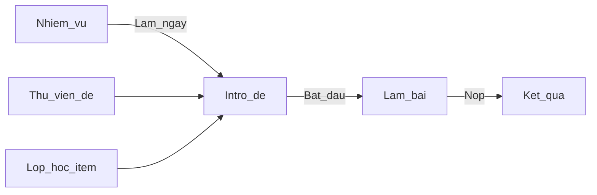
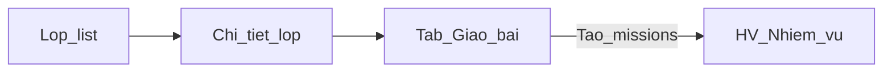
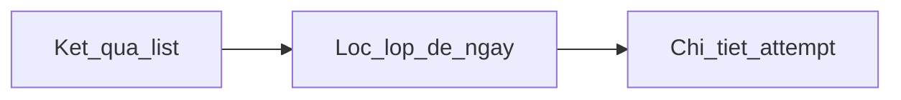
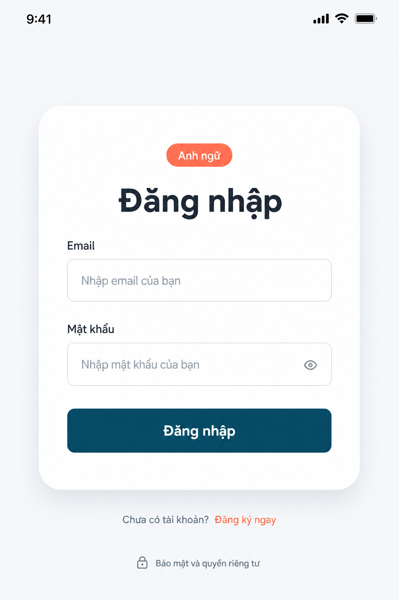
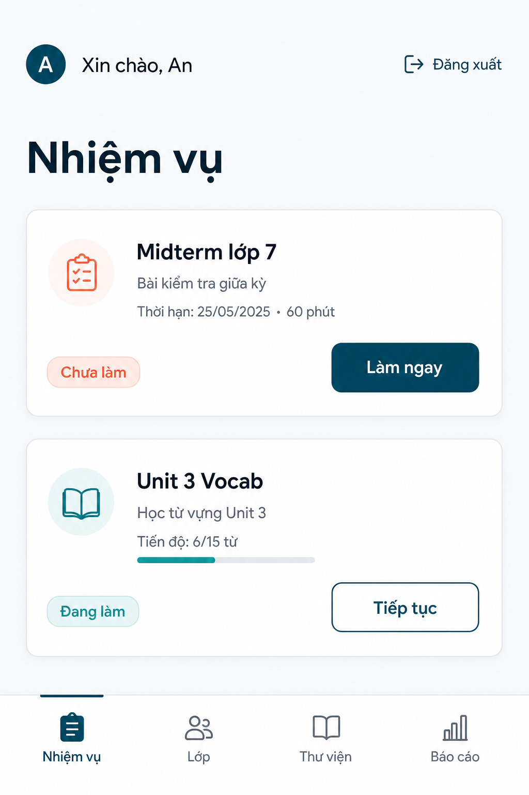
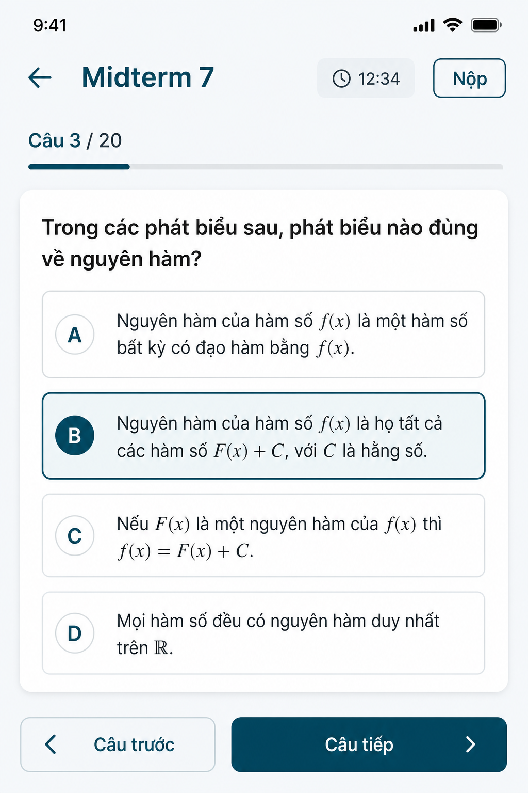
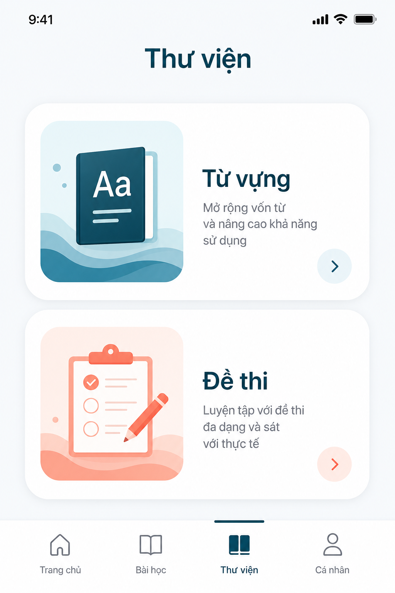
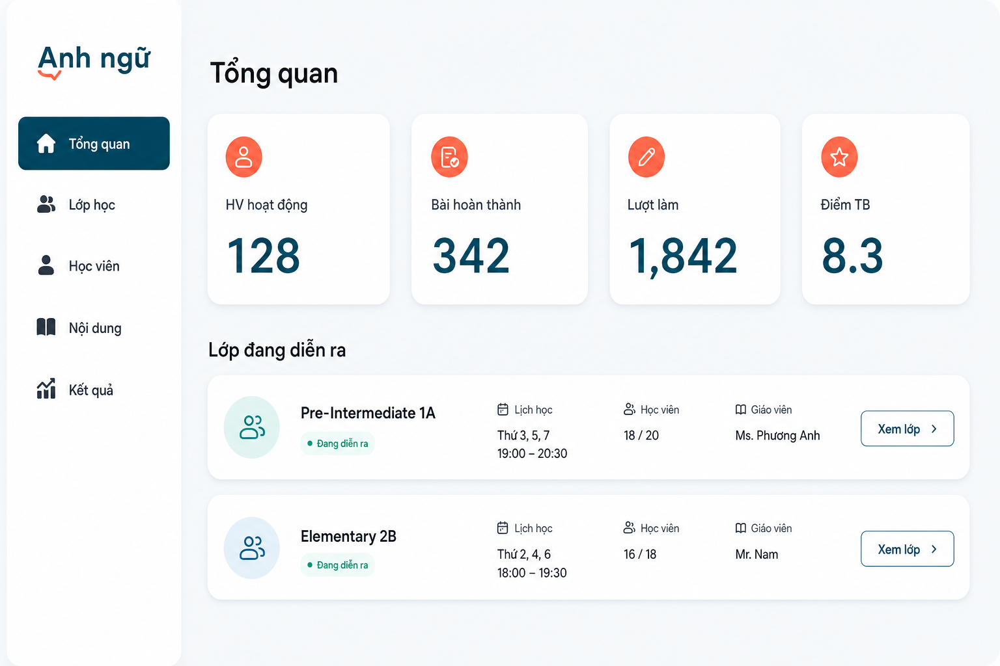
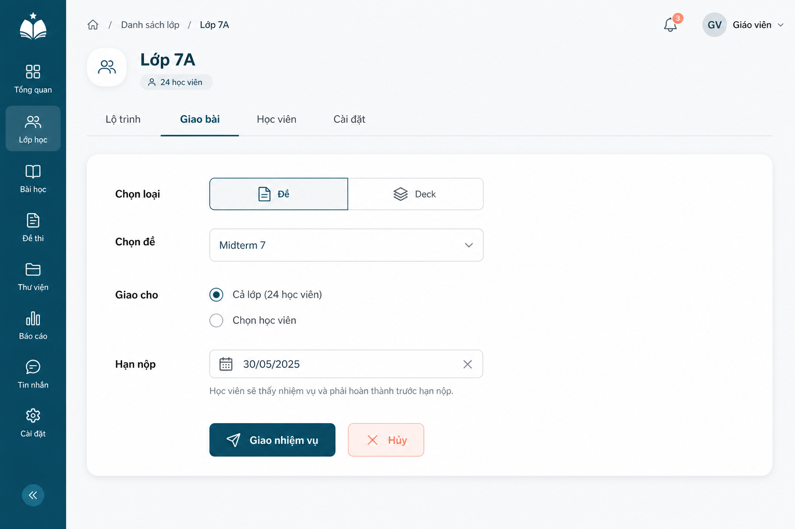

# UI Wireframes — Cốt lõi HV + GV

> Design trước khi code. Token: [DESIGN-SYSTEM.md](DESIGN-SYSTEM.md) · IA: `backend/docs/DESIGN-ADMIN-HOC-VIEN.md`.  
> High-fi tham chiếu: [mocks/](mocks/) — implement theo wireframe + design system, không pixel-copy tuyệt đối.

**Không làm trên UI này:** tin tức, balloon marketing, FAB AI, marketplace, ví xu.

---

## 1. Nguyên tắc layout

| Vai trò | Viewport | Shell |
|---------|----------|--------|
| Học viên | Mobile-first (375+) | Header gọn + **bottom nav 4 mục** |
| Giáo viên | Desktop-first (1024+) | **Sidebar ≤ 6 mục** + top bar tên GV |

- Nền trang `#F5F5F5` · surface/card `#FFFFFF` · primary `#002854` · accent `#F5AC3D`.
- Font Quicksand (sans). Icon SVG outline — không emoji.
- Touch target ≥ 44×44px; focus ring rõ; contrast ≥ 4.5:1.
- Một job / một section; tránh card lồng card vô nghĩa.

### Shell HV

```
┌─────────────────────────────┐
│  Xin chào, An    [Đăng xuất]│
│  ─ content (1 cột) ─        │
│                             │
├──────┬─────┬────────┬───────┤
│Nhiệm │ Lớp │Thư viện│Báo cáo│  ← active = brand navy
│ vụ   │     │        │       │
└──────┴─────┴────────┴───────┘
```

### Shell GV

```
┌──────────┬──────────────────────────┐
│ Logo     │  GV: Cô Uyên             │
│──────────│──────────────────────────│
│ Tổng quan│                          │
│ Lớp học  │     Content area         │
│ Học viên │                          │
│ Nội dung │                          │
│ Kết quả  │                          │
└──────────┴──────────────────────────┘
```

Sidebar: item inactive chữ `#1F2937`; **active** nền `#002854` chữ trắng.

---

## 2. Wireflow chính

### HV làm đề được giao



### GV giao bài



### GV xem điểm



---

## 3. High-fi mocks (tham chiếu visual)

### Lumen — hướng hiện tại (ưu tiên)

Ocean `#0E4A5C` + Coral `#FF6B4A` — xem [mocks/lumen/](mocks/lumen/).

| Ảnh | Màn |
|-----|-----|
|  | Login |
|  | Nhiệm vụ HV |
|  | Làm bài MCQ |
|  | Thư viện hub |
|  | Teacher overview |
|  | Teacher assign |

### Bản cũ (navy / amber — tham khảo)

| Ảnh | Màn |
|-----|-----|
| [01-login.png](mocks/01-login.png) | Login |
| [02-missions.png](mocks/02-missions.png) | Nhiệm vụ |
| [03-take-test.png](mocks/03-take-test.png) | Làm bài |

> Caption: tham chiếu visual — implement theo wireframe + **Lumen tokens** (ưu tiên) hoặc DESIGN-SYSTEM nếu chưa migrate.

---

## 4. Học viên — màn hình

### 4.1. Login — `/login`

**Mục đích:** HV/GV đăng nhập (email + mật khẩu); không đăng ký công khai.

**Vùng UI:**
- Nền `#F5F5F5` (không balloon bắt buộc)
- Card trắng radius ~24px, padding 32–40px, căn giữa
- Logo / tên app (brand navy) phía trên card hoặc trong card
- Fields: Email *, Mật khẩu * (toggle hiện/ẩn)
- Link phụ: Quên mật khẩu (nếu có API; không thì ẩn)
- CTA full-width: **Đăng nhập** (primary navy, h~48)

**CTA chính:** Đăng nhập → redirect theo role (`/(app)/missions` hoặc `/teacher`).

**Empty / lỗi:** message dưới field hoặc banner đỏ nhạt trong card (`ApiError`).

**A11y:** label thật; `autocomplete`; focus ring brand; nút không chỉ dựa màu.

```
        ┌─────────────────────┐
        │     Anh ngữ         │
        │     Đăng nhập       │
        │  Email  [........]  │
        │  MK     [........]  │
        │  [   Đăng nhập   ]  │
        └─────────────────────┘
```

---

### 4.2. Nhiệm vụ — `/(app)/missions`

**Mục đích:** Xem việc được giao / tự thêm; vào làm ngay.

**Vùng UI:**
- Title “Nhiệm vụ”
- Filter chips optional: Tất cả · Chưa làm · Đang làm · Xong
- List rows (card trắng):
  - Thumb / icon loại (Đề | Deck)
  - Title + meta (deadline, lớp)
  - Badge status: `todo` | `in_progress` | `done`
  - CTA **Làm ngay ›** (primary) — ẩn hoặc “Xem lại” khi done

**CTA chính:** Làm ngay → intro đề hoặc deck học thẻ.

**Empty:** “Chưa có nhiệm vụ. Vào Thư viện hoặc chờ giáo viên giao.” + link Thư viện.

**A11y:** status không chỉ màu (có text); hàng là button/link rõ ràng.

```
Nhiệm vụ
┌────────────────────────────────┐
│ [Đề] Midterm 7    Chưa làm     │
│ Deadline 20/07    [Làm ngay ›] │
├────────────────────────────────┤
│ [Deck] Unit 3     Đang làm     │
│                   [Tiếp tục ›] │
└────────────────────────────────┘
```

---

### 4.3. Lớp học — `/(app)/classes` · `/(app)/classes/[id]`

**Mục đích:** Xem lớp đang học + lộ trình buổi → mở item.

**Vùng UI:**
- Nếu 1 lớp: vào thẳng chi tiết; nếu nhiều: list chọn lớp
- Header lớp: tên + status
- List buổi (`class_sessions`): “Buổi 1 — …”, note read-only nếu có
- Trong buổi: `session_items` — chip Đề / Deck → tap mở intro hoặc học thẻ

**CTA chính:** Mở item lộ trình.

**Empty:** “Bạn chưa được gán lớp. Liên hệ giáo viên.”

**A11y:** heading theo buổi; list semantic.

```
Lớp 7A
Buổi 1 — Reading
  · Đề: Passage 1     ›
  · Deck: Vocab W1    ›
Buổi 2 — Listening
  · Đề: Part 1        ›
```

---

### 4.4. Thư viện — hub + con

#### Hub — `/(app)/library`

**Mục đích:** Chọn Từ vựng hoặc Đề thi (không tin tức/tài liệu marketing).

```
Thư viện
┌─────────────┐  ┌─────────────┐
│  Từ vựng    │  │  Đề thi     │
│  Học thẻ    │  │  Luyện đề   │
└─────────────┘  └─────────────┘
```

**CTA:** vào list tương ứng.  
**Empty:** không áp dụng ở hub.

#### Từ vựng list — `/(app)/library/vocab`

- List deck: tên, số thẻ, progress nhẹ (optional)
- CTA: vào deck

**Empty:** “Chưa có bộ từ.”

#### Học thẻ — `/(app)/library/vocab/[deck]`

- Card lật: term / meaning (+ IPA, audio nếu có)
- Prev / Next · đánh dấu New / Learning / Known
- Không animation phức tạp bắt buộc MVP

**CTA:** lưu tiến độ (status).  
**A11y:** nút lật có tên; audio có control thật.

#### Đề list — `/(app)/library/tests`

- Rows: title, skill badge, duration
- Không filter IELTS/TOEIC catalog lớn — tối đa chip “Tất cả” nếu cần

**CTA:** → Intro đề.

#### Intro đề — `/(app)/tests/[id]` hoặc `/attempts/start`

```
Midterm lớp 7
45 phút · 20 câu · Reading
[ Bắt đầu làm bài ]
```

**CTA:** Bắt đầu → tạo attempt.  
**Empty:** đề unpublished — không hiện trong list.

---

### 4.5. Làm bài — `/(app)/attempts/[id]`

**Mục đích:** Trả lời câu (MCQ trước); timer từ server; nộp.

**Vùng UI:**
- Top: tên đề rút gọn · **timer** (warning khi < 5 phút) · nút Nộp
- Progress: “Câu 3 / 20” hoặc dots
- Stem câu + options A/B/C/D (radio lớn, touch-friendly)
- Nav: Trước · Sau

**CTA chính:** Nộp → confirm dialog → kết quả.

**Empty / edge:** hết giờ → auto submit / status expired (copy rõ).

**A11y:** fieldset/legend hoặc `role="radiogroup"`; timer `aria-live="polite"`.

```
┌ Midterm 7          12:34  [Nộp] ┐
│ Câu 3/20                         │
│ What is the main idea…?          │
│ ( ) A. …                         │
│ (•) B. …                         │
│ ( ) C. …                         │
│ ( ) D. …                         │
│ [‹ Trước]              [Sau ›]   │
└──────────────────────────────────┘
```

---

### 4.6. Kết quả attempt — `/(app)/attempts/[id]/result`

**Mục đích:** Điểm, số đúng, review xanh/đỏ + lời giải.

**Vùng UI:**
- Score hero (số lớn brand) + correct/total
- List câu: icon đúng/sai · stem rút · explanation khi expand hoặc luôn hiện sau nộp

**CTA:** Về Nhiệm vụ · Làm lại (nếu policy cho phép).

**A11y:** không chỉ màu — có chữ Đúng/Sai.

---

### 4.7. Báo cáo — `/(app)/reports`

**Mục đích:** Tóm tắt học tập tuần/gần đây.

**Vùng UI:**
- 4 chỉ số: Điểm TB · Số bài · Lượt làm · Thời gian học (ước lượng)
- Lịch sử attempt: ngày · đề · điểm → tap xem result

**CTA:** mở chi tiết attempt.  
**Empty:** “Chưa có bài làm.”

```
Báo cáo
[ TB 7.5 ] [ 4 bài ] [ 12 lượt ] [ 3h ]
Gần đây
· Midterm 7   8.0   12/07
· Vocab quiz  6.5   11/07
```

---

## 5. Giáo viên — màn hình

### 5.1. Tổng quan — `/teacher`

**Mục đích:** Nhìn nhanh hoạt động tuần.

**Vùng UI:**
- 4 stat cards: HV hoạt động · Bài hoàn thành · Lượt làm · Điểm TB tuần
- Block “Lớp đang diễn ra”: tên · số HV · link chi tiết

**CTA:** vào lớp / kết quả.  
**Empty stats:** hiện 0, không skeleton vô hạn.

---

### 5.2. Lớp học

#### List — `/teacher/classes`

- Table/cards: tên, số HV, active, actions Sửa / Ẩn
- CTA: **Tạo lớp**

**Empty:** “Chưa có lớp. Tạo lớp đầu tiên.”

#### Chi tiết — `/teacher/classes/[id]`

Tabs: **Lộ trình** · **Giao bài** · **Học viên** · **Cài đặt**

**Lộ trình**
- CRUD buổi (order, title, note)
- Trong buổi: thêm item morph Test | Deck (order)
- CTA: Thêm buổi / Thêm item

**Giao bài**
- Chọn loại Đề | Deck → chọn resource → đối tượng: cả lớp / vài HV → due_date optional
- CTA: **Giao** → tạo N missions
- Confirm tóm tắt số HV

**Học viên (trong lớp)**
- List HV + status studying/finished/paused
- Thêm / xóa khỏi lớp · Reset mật khẩu (confirm)

**Cài đặt**
- name, description, starts_on, ends_on, is_active
- CTA: Lưu

**A11y:** tabs `role="tablist"`; form labels.

---

### 5.3. Học viên — `/teacher/students`

**Mục đích:** Quản lý tài khoản HV toàn trung tâm.

**Vùng UI:**
- Search email/tên
- Table: tên, email, is_active, lớp (tóm tắt)
- Actions: Tạo HV · Khóa/Mở · Gán lớp

**CTA chính:** Tạo HV (email + mật khẩu tạm).  
**Empty:** “Chưa có học viên.”  
**A11y:** confirm trước khi khóa.

---

### 5.4. Nội dung — `/teacher/content`

Tabs: **Từ vựng** | **Đề thi**

**Từ vựng**
- List decks → CRUD deck + cards (term, meaning, IPA, audio optional)
- CTA: Tạo deck / Thêm thẻ

**Đề thi**
- List tests (published toggle)
- Editor tối thiểu: Part → Section → Question MCQ + options + explanation
- Không AI / IELTS simulation editor

**Empty:** CTA tạo đầu tiên.  
**A11y:** bảng/list có caption; toggle published có label.

---

### 5.5. Kết quả — `/teacher/results`

**Mục đích:** Xem attempt đã nộp; drill-down đúng/sai.

**Vùng UI:**
- Filters: lớp · đề · khoảng ngày
- Table: HV · đề · điểm · submitted_at · [Xem]
- Chi tiết (page hoặc drawer): list câu đúng/sai + explanation

**CTA:** Xem chi tiết.  
**Empty:** “Chưa có bài nộp khớp bộ lọc.”

```
Kết quả    [Lớp ▼] [Đề ▼] [Từ ngày]
┌──────────────────────────────────────┐
│ An   Midterm7  8.0  12/07  [Xem]     │
│ Bình Midterm7  6.5  12/07  [Xem]     │
└──────────────────────────────────────┘
```

---

## 6. Component map → code

| UI | `components/ui` | `features/...` |
|----|-----------------|----------------|
| Primary / Accent / Ghost button | `Button` | — |
| Text field + error | `Input`, `FieldError` | — |
| Status badge (todo/doing/done, đúng/sai) | `Badge` | — |
| Bottom nav HV | `BottomNav` | shell |
| Sidebar GV | `Sidebar` | shell |
| Mission row + Làm ngay | — | `features/missions` |
| Session / roadmap list | — | `features/classrooms` |
| Deck list + flashcard | — | `features/library` |
| Test intro + take + result | — | `features/attempts` |
| Report stats + history | — | `features/reports` |
| Assign form, results table | — | `features/teacher/*` |
| API calls | — | `lib/api/*` |

Khớp Architecture trong skill FE: page mỏng → feature → `lib/api`.

---

## 7. Route gợi ý (Next.js App Router)

| Route | Role | Màn |
|-------|------|-----|
| `/login` | public | Login |
| `/(app)/missions` | student | Nhiệm vụ |
| `/(app)/classes` | student | Lớp list/chi tiết |
| `/(app)/classes/[id]` | student | Lộ trình |
| `/(app)/library` | student | Hub thư viện |
| `/(app)/library/vocab` | student | List deck |
| `/(app)/library/vocab/[deck]` | student | Học thẻ |
| `/(app)/library/tests` | student | List đề |
| `/(app)/tests/[id]` | student | Intro đề |
| `/(app)/attempts/[id]` | student | Làm bài |
| `/(app)/attempts/[id]/result` | student | Kết quả |
| `/(app)/reports` | student | Báo cáo |
| `/teacher` | teacher | Tổng quan |
| `/teacher/classes` | teacher | List lớp |
| `/teacher/classes/[id]` | teacher | Chi tiết tabs |
| `/teacher/students` | teacher | Học viên |
| `/teacher/content` | teacher | Deck + Đề |
| `/teacher/results` | teacher | Kết quả |

Guard: layout `(app)` yêu cầu `student` (hoặc cả teacher nếu xem thử); `/teacher/*` yêu cầu `teacher`/`admin`. API vẫn authorize.

---

## 8. Checklist trước khi implement từng màn

- [ ] Bám token DESIGN-SYSTEM (không invent purple)
- [ ] Empty state + lỗi form có copy VI
- [ ] CTA chính một chỗ rõ
- [ ] A11y: label, focus, status có text
- [ ] HV ≤ 4 bottom nav; GV sidebar ≤ 6
- [ ] Không balloon / FAB AI / tin tức
